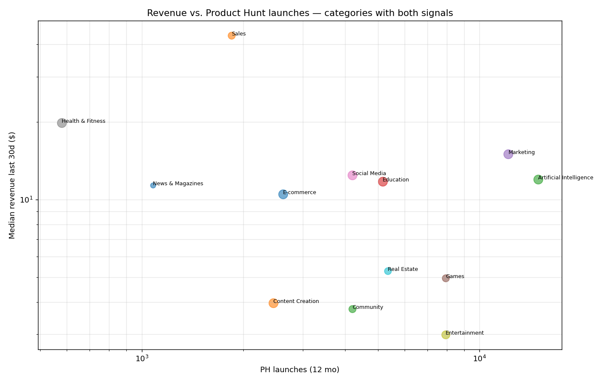
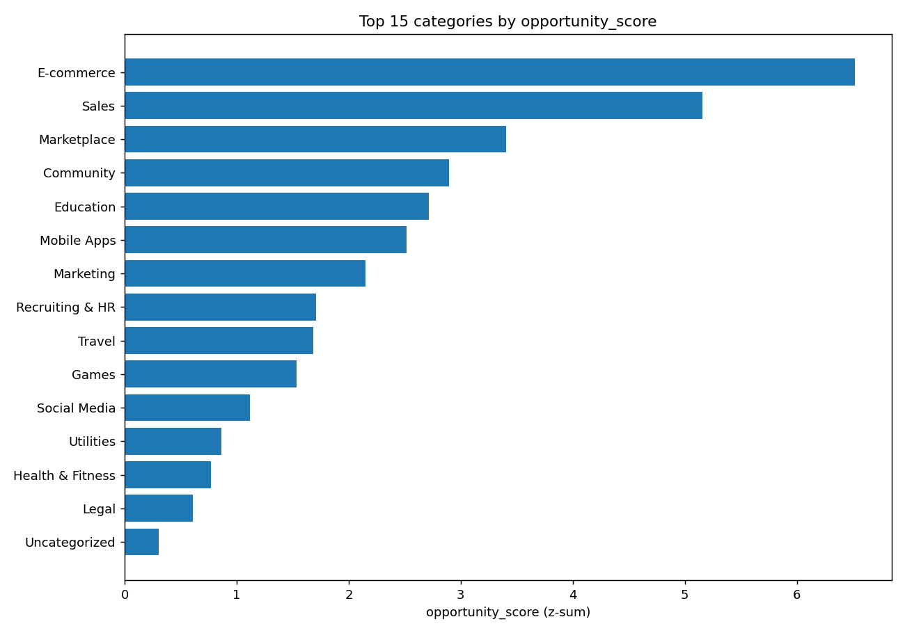
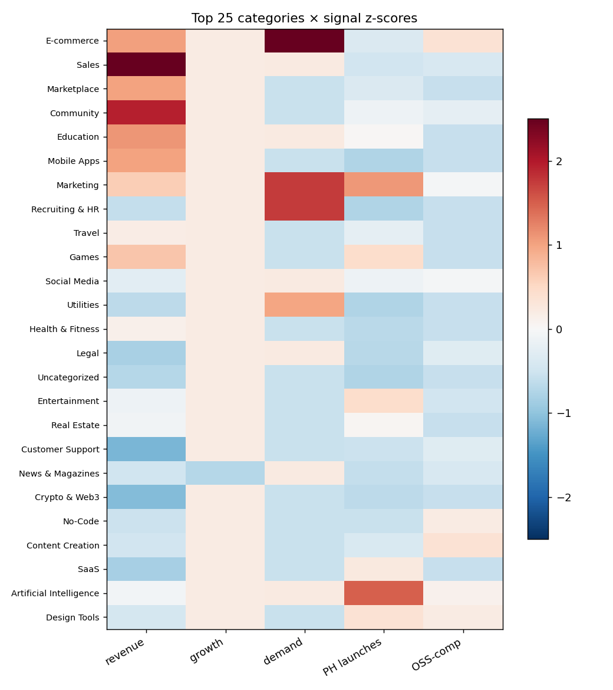

# Micro-SaaS Niche Research — synthesis report
> Cross-source synthesis: TrustMRR (revenue) × Product Hunt (launches) × awesome-oss-* (OSS competition) × Reddit/pullpush (demand). Sample sizes and data-availability gaps documented inline. **No numbers are estimated** — only data actually fetched is shown.

## Data summary

- **TrustMRR startups loaded**: 7,130
- **TrustMRR categories**: 32
- **OSS alternatives parsed**: 295 across 103 OSS-list categories
- **Product Hunt topics**: 47/47 with data scraped via hydration regex (no OAuth available)
- **Reddit pain signals**: 65 matched quotes from 6 subreddits via pullpush.io

> **Revenue note**: TrustMRR includes startups at every stage, so naive medians are dragged to $0 (about 49% of listed startups have $0 in last-30d revenue). We use **p75 (75th percentile)** and **pct_profitable (% > $1k/mo)** as the revenue signal — these capture how viable the niche is for *successful* players, not the average outcome.

## Top 10 niches by opportunity_score (n_startups ≥ 20)

### 1. E-commerce  &nbsp;&nbsp;`score=+6.52`

- **TrustMRR**: 136 startups; p75 30d-revenue **$447**, p90 **$6k**, top earner **$7.1M**, share with >$1k/mo: **21%**, category-wide last 30d **$11.2M**
- **Growth**: median 30d growth +0.0%
- **PH launches (12 mo)**: 2616.0 (topic: e-commerce)
- **Open-source alternatives** (awesome-oss-* lists): 11 — matched: E-commerce|Online store builder (Shopify alternatives)
- **Reddit pain matches**: 6
- **Top 3 incumbents (TrustMRR last 30d revenue)**:
  - **Gumroad** — $7.1M (US, founded 2011-11-05)
  - **easytools** — $2.7M (PL, founded 2021-05-14)
  - **Brand On Demand, Inc.** — $1.1M (US, founded 2017-06-11)
- **Sample pain quotes from Reddit**:
  > itors) =$750 Ummm, influencer #3 seems overpriced and influencer #1 is providing some good value for the money! Quick, simple, repeatable. And if it’s not worth it, negotiate! *You can t
  > ustomizable backpacks. As this idea was too expensive to start with, I had to find a USP which is at least somehow related to my initial one. The plan was to sell one type of backpack + custom
  > the price later. As $99.99 didn’t sound too expensive for a custom/hand painted backpack, I moved on. ## Setting a business goal I’m using the SMART goal-setting model to set my business goal

### 2. Sales  &nbsp;&nbsp;`score=+5.16`

- **TrustMRR**: 66 startups; p75 30d-revenue **$719**, p90 **$5k**, top earner **$79k**, share with >$1k/mo: **21%**, category-wide last 30d **$157k**
- **Growth**: median 30d growth +0.0%
- **PH launches (12 mo)**: 1842.0 (topic: sales)
- **Open-source alternatives** (awesome-oss-* lists): 2 — matched: CRM (Salesforce, Hubspot alternatives)|Integration Platform (Tray.io, Merge.dev alternatives)
- **Reddit pain matches**: 1
- **Top 3 incumbents (TrustMRR last 30d revenue)**:
  - **Salesrobot, INC** — $79k (US, founded 2023-07-12)
  - **Lancer.app** — $16k (EE, founded 2025-04-24)
  - **Bookedin** — $11k (US, founded 2023-06-22)
- **Sample pain quotes from Reddit**:
  > time. *8. Make it about them, not you* I wish I could say it’s a rookie mistake to try and score any kind of relationship by only focusing on yourself but that would be a blatant lie. The truth

### 3. Marketplace  &nbsp;&nbsp;`score=+3.41`

- **TrustMRR**: 85 startups; p75 30d-revenue **$443**, p90 **$9k**, top earner **$189k**, share with >$1k/mo: **24%**, category-wide last 30d **$589k**
- **Growth**: median 30d growth +0.0%
- **PH launches (12 mo)**: 2616.0 (topic: e-commerce)
- **Open-source alternatives** (awesome-oss-* lists): 0
- **Reddit pain matches**: 0
- **Top 3 incumbents (TrustMRR last 30d revenue)**:
  - **PressWhizz** — $189k (US, founded 2024-09-30)
  - **MaidsnBlack** — $128k (US, founded 2013-02-21)
  - **Anonymous startup** — $123k (nan, founded 2025-05-01)

### 4. Community  &nbsp;&nbsp;`score=+2.89`

- **TrustMRR**: 68 startups; p75 30d-revenue **$617**, p90 **$4k**, top earner **$29k**, share with >$1k/mo: **19%**, category-wide last 30d **$131k**
- **Growth**: median 30d growth +0.0%
- **PH launches (12 mo)**: 4204.0 (topic: social-media)
- **Open-source alternatives** (awesome-oss-* lists): 4 — matched: Community Platform|Community management|Forum Software
- **Reddit pain matches**: 0
- **Top 3 incumbents (TrustMRR last 30d revenue)**:
  - **Athletiks** — $29k (ES, founded 2024-03-29)
  - **Advise.so** — $20k (CA, founded 2022-12-06)
  - **Fundlyhub** — $20k (US, founded 2025-09-20)

### 5. Education  &nbsp;&nbsp;`score=+2.71`

- **TrustMRR**: 312 startups; p75 30d-revenue **$461**, p90 **$4k**, top earner **$200k**, share with >$1k/mo: **18%**, category-wide last 30d **$814k**
- **Growth**: median 30d growth +0.0%
- **PH launches (12 mo)**: 5164.0 (topic: education)
- **Open-source alternatives** (awesome-oss-* lists): 0
- **Reddit pain matches**: 1
- **Top 3 incumbents (TrustMRR last 30d revenue)**:
  - **Kibu** — $200k (US, founded 2022-01-19)
  - **Codédex** — $78k (US, founded 2022-10-01)
  - **Teachizy** — $65k (FR, founded 2020-04-02)
- **Sample pain quotes from Reddit**:
  > lifestyle and work methods promised an alternative to my way of doing things. Paris felt more and more like a prison where I didn’t see any future. A few weeks later we decided to leave Paris. W

### 6. Mobile Apps  &nbsp;&nbsp;`score=+2.52`

- **TrustMRR**: 318 startups; p75 30d-revenue **$446**, p90 **$3k**, top earner **$99k**, share with >$1k/mo: **17%**, category-wide last 30d **$511k**
- **Growth**: median 30d growth +0.0%
- **PH launches (12 mo)**: — no data —
- **Open-source alternatives** (awesome-oss-* lists): 0
- **Reddit pain matches**: 0
- **Top 3 incumbents (TrustMRR last 30d revenue)**:
  - **PropGPT: AI Props Analysis** — $99k (US, founded 2024-09-15)
  - **Anonymous startup** — $37k (CA, founded 2025-08-01)
  - **Anonymous startup** — $28k (FR, founded 2017-03-01)

### 7. Marketing  &nbsp;&nbsp;`score=+2.15`

- **TrustMRR**: 381 startups; p75 30d-revenue **$373**, p90 **$5k**, top earner **$699k**, share with >$1k/mo: **17%**, category-wide last 30d **$2.0M**
- **Growth**: median 30d growth +0.0%
- **PH launches (12 mo)**: 12159.0 (topic: marketing)
- **Open-source alternatives** (awesome-oss-* lists): 6 — matched: Customer Engagement|Email marketing|Marketing SaaS|Newsletters (ConvertKit alternatives)
- **Reddit pain matches**: 3
- **Top 3 incumbents (TrustMRR last 30d revenue)**:
  - **Stack Influence** — $699k (US, founded 2020-01-12)
  - **Shugert Marketing** — $198k (US, founded 2024-03-03)
  - **Indexsy** — $125k (CA, founded 2015-12-10)
- **Sample pain quotes from Reddit**:
  > n and build the email marketing company I wish I had when I started growing an audience. Today ConvertKit earns over $18 million per year. Nearly seven years after starting ConvertKit it is
  > th. The investment was worth it, though I wish I had known the right professionals to hire from the start. Now, let’s dive into a controversial topic: Do you need to build links? ## Step 9:
  > most and what I wish I’d known sooner. I wish I had had a post like this. Because the growth playbook for early-stage startups isn’t well known. There simply aren’t many people who’ve done it

### 8. Recruiting & HR  &nbsp;&nbsp;`score=+1.71`

- **TrustMRR**: 96 startups; p75 30d-revenue **$149**, p90 **$846**, top earner **$15k**, share with >$1k/mo: **9%**, category-wide last 30d **$54k**
- **Growth**: median 30d growth +0.0%
- **PH launches (12 mo)**: — no data —
- **Open-source alternatives** (awesome-oss-* lists): 0
- **Reddit pain matches**: 3
- **Top 3 incumbents (TrustMRR last 30d revenue)**:
  - **Hirevire** — $15k (IN, founded 2021-12-04)
  - **Career Hound** — $12k (CA, founded 2025-01-15)
  - **Anonymous startup** — $5k (CH, founded 2020-05-01)
- **Sample pain quotes from Reddit**:
  > pricing - providing better and cheaper alternative to traditional limited and expensive SMS/MMS. In fact, WhatsApp offered valuable, sought-after features above and beyond what mobile carriers were providi
  > nd a location in a great area thats not overpriced to set up. And here i am! Officially on my third week of owning a local yarn store. My classes are filling up and I'm already on schedule t
  > ber of books in one order was 10 It was too expensive They found a workaround. They always ordered the book they wanted + 9 copies of a book about lichens that was constantly out of stock.The

### 9. Travel  &nbsp;&nbsp;`score=+1.68`

- **TrustMRR**: 51 startups; p75 30d-revenue **$293**, p90 **$6k**, top earner **$421k**, share with >$1k/mo: **20%**, category-wide last 30d **$512k**
- **Growth**: median 30d growth +0.0%
- **PH launches (12 mo)**: 3463.0 (topic: travel)
- **Open-source alternatives** (awesome-oss-* lists): 0
- **Reddit pain matches**: 0
- **Top 3 incumbents (TrustMRR last 30d revenue)**:
  - **Jungle Bee** — $421k (US, founded 2016-08-03)
  - **esim4u** — $46k (UA, founded 2025-04-24)
  - **OVER THE PLANET** — $12k (AU, founded 2020-07-17)

### 10. Games  &nbsp;&nbsp;`score=+1.53`

- **TrustMRR**: 66 startups; p75 30d-revenue **$386**, p90 **$3k**, top earner **$32k**, share with >$1k/mo: **20%**, category-wide last 30d **$112k**
- **Growth**: median 30d growth +0.0%
- **PH launches (12 mo)**: 7929.0 (topic: games)
- **Open-source alternatives** (awesome-oss-* lists): 0
- **Reddit pain matches**: 0
- **Top 3 incumbents (TrustMRR last 30d revenue)**:
  - **Ship or Die** — $32k (SG, founded 2026-05-07)
  - **Talefy** — $27k (US, founded 2023-05-08)
  - **ForYouGaming Inc.** — $15k (US, founded 2025-08-22)

## Anti-recommendations — 5 niches to AVOID

Sorted ascending by opportunity_score (worst first). Typically: high OSS dominance, high PH saturation, or thin/declining revenue.

- **Green Tech** (`score=-7.96`): 5 startups, median 30d rev $20, PH launches nan, OSS alts 0
- **IoT & Hardware** (`score=+4.37`): 10 startups, median 30d rev $14, PH launches nan, OSS alts 0
- **Productivity** (`score=-8.35`): 451 startups, median 30d rev $0, PH launches 32141.0, OSS alts 20
- **Developer Tools** (`score=-6.35`): 452 startups, median 30d rev $0, PH launches 13662.0, OSS alts 59
- **Security** (`score=-3.09`): 45 startups, median 30d rev $0, PH launches 13662.0, OSS alts 26

## Charts

## Data gaps (honest)

- **GitHub Search API**: no token — could not enumerate star counts per repo, so OSS competition is measured by `n_alternatives` in curated awesome-* lists only.
- **Product Hunt**: no OAuth — used HTML hydration scrape against ~64 hand-picked topic slugs; categories without a slug mapping show no launches signal.
- **Reddit**: direct API + mirrors blocked from this IP; used pullpush.io for top-by-score year filter, ≤500 posts per sub. Pattern-matching is regex-based, so demand signal is a lower bound.
- **Category mapping** (TrustMRR ↔ PH topic ↔ awesome-* category) is manual; categories with no mapping receive z=0 (neutral) for the missing signal.
