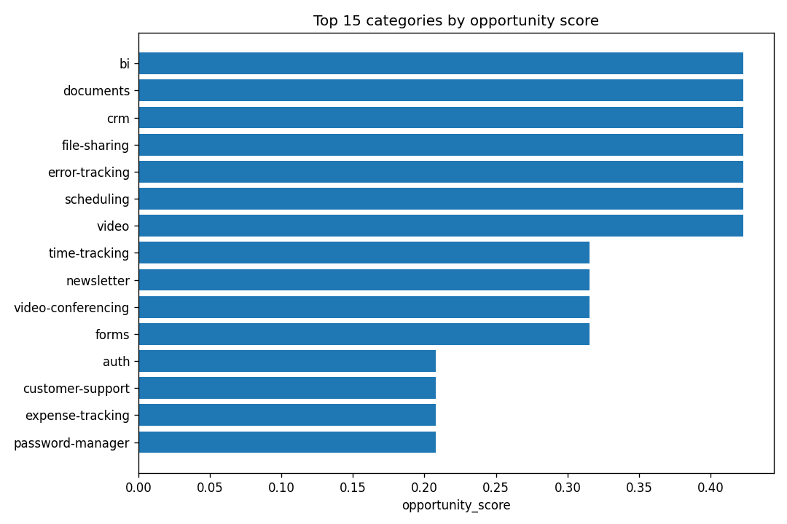

# Micro-SaaS niche research

> **Partial run.** The following sources produced no data and their signals are excluded from the score: `trustmrr, producthunt, reddit`.
>
> The `opportunity_score` for any row reflects only the sources listed in its `coverage` column. Treat rows with `n_sources < 3` as exploratory.

## Executive summary

- Categories scored: **29**

- Sources contributing: **oss**

- Top pick `bi` — score `0.42` (coverage: oss)

- Top pick `documents` — score `0.42` (coverage: oss)

- Top pick `crm` — score `0.42` (coverage: oss)

## Top-10 niches

### bi

- **Opportunity score:** 0.42  
- **Coverage:** oss  
- **Median MRR:** _no data — source unavailable_  
- **PH launches (12mo):** _no data — source unavailable_  
- **OSS alternatives listed:** 1 (star counts skipped — set GITHUB_TOKEN to enrich)  

### documents

- **Opportunity score:** 0.42  
- **Coverage:** oss  
- **Median MRR:** _no data — source unavailable_  
- **PH launches (12mo):** _no data — source unavailable_  
- **OSS alternatives listed:** 1 (star counts skipped — set GITHUB_TOKEN to enrich)  

### crm

- **Opportunity score:** 0.42  
- **Coverage:** oss  
- **Median MRR:** _no data — source unavailable_  
- **PH launches (12mo):** _no data — source unavailable_  
- **OSS alternatives listed:** 1 (star counts skipped — set GITHUB_TOKEN to enrich)  

### file-sharing

- **Opportunity score:** 0.42  
- **Coverage:** oss  
- **Median MRR:** _no data — source unavailable_  
- **PH launches (12mo):** _no data — source unavailable_  
- **OSS alternatives listed:** 1 (star counts skipped — set GITHUB_TOKEN to enrich)  

### error-tracking

- **Opportunity score:** 0.42  
- **Coverage:** oss  
- **Median MRR:** _no data — source unavailable_  
- **PH launches (12mo):** _no data — source unavailable_  
- **OSS alternatives listed:** 1 (star counts skipped — set GITHUB_TOKEN to enrich)  

### scheduling

- **Opportunity score:** 0.42  
- **Coverage:** oss  
- **Median MRR:** _no data — source unavailable_  
- **PH launches (12mo):** _no data — source unavailable_  
- **OSS alternatives listed:** 1 (star counts skipped — set GITHUB_TOKEN to enrich)  

### video

- **Opportunity score:** 0.42  
- **Coverage:** oss  
- **Median MRR:** _no data — source unavailable_  
- **PH launches (12mo):** _no data — source unavailable_  
- **OSS alternatives listed:** 1 (star counts skipped — set GITHUB_TOKEN to enrich)  

### time-tracking

- **Opportunity score:** 0.32  
- **Coverage:** oss  
- **Median MRR:** _no data — source unavailable_  
- **PH launches (12mo):** _no data — source unavailable_  
- **OSS alternatives listed:** 2 (star counts skipped — set GITHUB_TOKEN to enrich)  

### newsletter

- **Opportunity score:** 0.32  
- **Coverage:** oss  
- **Median MRR:** _no data — source unavailable_  
- **PH launches (12mo):** _no data — source unavailable_  
- **OSS alternatives listed:** 2 (star counts skipped — set GITHUB_TOKEN to enrich)  

### video-conferencing

- **Opportunity score:** 0.32  
- **Coverage:** oss  
- **Median MRR:** _no data — source unavailable_  
- **PH launches (12mo):** _no data — source unavailable_  
- **OSS alternatives listed:** 2 (star counts skipped — set GITHUB_TOKEN to enrich)  

## Anti-recommendations (saturated / dead markets)

- `knowledge-base` — score `-1.62` (coverage: oss)
- `design` — score `-0.98` (coverage: oss)
- `automation` — score `-0.87` (coverage: oss)
- `chat` — score `-0.65` (coverage: oss)
- `data-warehouse` — score `-0.65` (coverage: oss)

## Charts

_Scatter chart needs both TrustMRR and Product Hunt data — skipped._

