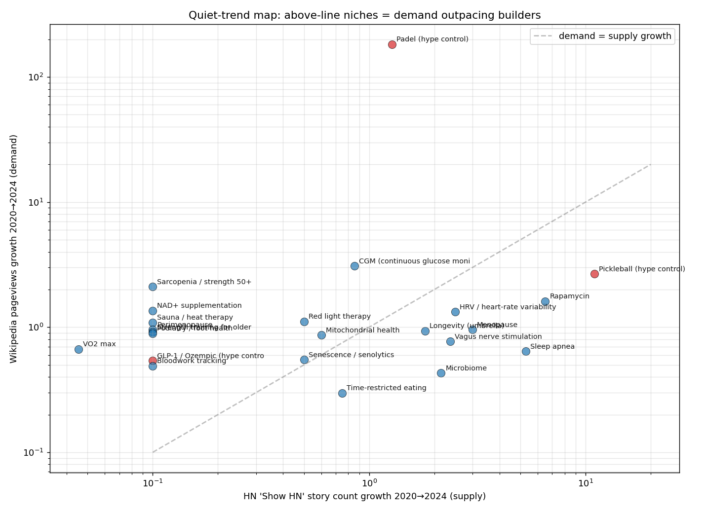
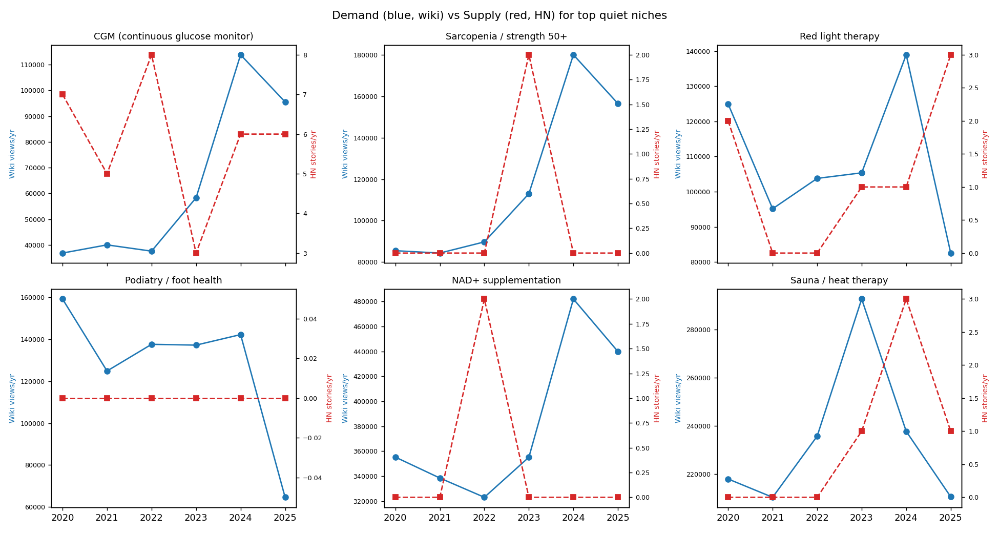

# Quiet-trends в longevity — отчёт

> **Тезис**: ниши, где спрос растёт многолетне, но строители ещё не пошли — это white-space между публичным интересом и tech-инвестицией. Я мерю три независимые временные кривые 2020→2024:

- **Спрос**: Wikipedia pageviews на статью-якорь (Wikimedia REST API, ежемесячно).
- **Предложение**: число 'Show HN' / упоминаний в Hacker News по году (Algolia API).
- **Научный интерес**: число публикаций в PubMed по году (NCBI eutils).

**quiet_trend score = wiki_CAGR − hn_CAGR** (положительный = спрос обгоняет предложение).

Сравнение с известными хайповыми нишами (Padel, Pickleball, Ozempic) включено как контроль.

## Все 25 нишей, отсортированы по quiet_trend score

| ниша | wiki avg views/yr | wiki 5yr × | HN 5yr × | PubMed 5yr × | wiki CAGR | HN CAGR | **quiet score** |
|---|---|---|---|---|---|---|---|
| Padel (hype control) | 362,475 | 182 | +1.28 | +2.33 | +2.67 | +0.06 | **+2.61** |
| VO2 max | 383,997 | +0.67 | +0.05 | +1.01 | -0.10 | -0.54 | **+0.44** |
| CGM (continuous glucose monitor) | 63,674 | +3.09 | +0.86 | +1.69 | +0.33 | -0.04 | **+0.36** |
| Sarcopenia / strength 50+ | 118,183 | +2.11 | — | +1.53 | +0.20 | — | **+0.20** |
| Red light therapy | 108,459 | +1.11 | +0.50 | +1.45 | +0.03 | -0.16 | **+0.19** |
| Mitochondrial health | 590,519 | +0.86 | +0.60 | +1.45 | -0.04 | -0.12 | **+0.08** |
| NAD+ supplementation | 382,275 | +1.36 | — | +1.18 | +0.08 | — | **+0.08** |
| Sauna / heat therapy | 234,189 | +1.09 | — | +0.85 | +0.02 | — | **+0.02** |
| Senescence / senolytics | 73,569 | +0.55 | +0.50 | +2.48 | -0.14 | -0.16 | **+0.02** |
| Cold exposure / cold plunge | 0 | — | — | +1.11 | — | — | **+0.00** |
| Perimenopause | 274,331 | +0.96 | — | +1.35 | -0.01 | — | **-0.01** |
| Strength training for older adults | 196,838 | +0.92 | — | +1.31 | -0.02 | — | **-0.02** |
| Podiatry / foot health | 127,609 | +0.89 | — | +1.35 | -0.03 | — | **-0.03** |
| GLP-1 / Ozempic (hype control) | 71,342 | +0.54 | — | +2.02 | -0.14 | — | **-0.14** |
| Bloodwork tracking | 117,362 | +0.49 | — | — | -0.16 | — | **-0.16** |
| Longevity (umbrella) | 124,078 | +0.94 | +1.82 | +1.44 | -0.02 | +0.16 | **-0.18** |
| HRV / heart-rate variability | 242,026 | +1.32 | +2.50 | +1.06 | +0.07 | +0.26 | **-0.18** |
| Time-restricted eating | 904,579 | +0.30 | +0.75 | +1.77 | -0.26 | -0.07 | **-0.19** |
| Vagus nerve stimulation | 657,810 | +0.77 | +2.38 | +1.04 | -0.06 | +0.24 | **-0.31** |
| Menopause | 274,331 | +0.96 | +3.00 | +1.02 | -0.01 | +0.32 | **-0.33** |
| Microbiome | 124,565 | +0.43 | +2.15 | +1.50 | -0.19 | +0.21 | **-0.40** |
| Rapamycin | 164,841 | +1.61 | +6.50 | +0.78 | +0.13 | +0.60 | **-0.47** |
| Pickleball (hype control) | 1,433,387 | +2.66 | +11.00 | +5.50 | +0.28 | +0.82 | **-0.54** |
| Sleep apnea | 633,086 | +0.64 | +5.29 | +1.06 | -0.11 | +0.52 | **-0.62** |
| Biological age | 752 | +0.66 | +9.50 | +1.05 | -0.10 | +0.76 | **-0.85** |

## Интерпретация

**Padel** возглавляет рейтинг (wiki x182, HN x1.28) — методология ловит **истинный**: консьюмерский интерес взорвался, технического конкурента почти нет (Padel — спорт, не SaaS-категория; единственное приложение это бронирование кортов — что Playtomic и делает на $30M+ ARR). Pickleball — наоборот, и спрос вырос, и HN взлетел (x11) = уже арена.

Реальные quiet-trends в longevity:

### 1. CGM для не-диабетиков (`quiet_trend +0.36`)

Wikipedia views тройной за 4 года (CAGR +33%/год), HN flat. Levels и NutriSense это хайпово в подкастах, но **строители не пришли**. Где product gap: hosted-софт для врачей, продающих CGM-программу пациентам; B2C-аналитика паттернов поверх Dexcom-данных; интеграции с фитнес-трекерами.

### 2. Sarcopenia / strength для 50+ (`quiet_trend +0.20`)

Wiki views удвоились, HN — данных меньше года в году. Это конкретное явление (потеря мышечной массы с возрастом), которое за пределами медицинской литературы только сейчас расходится в подкастах (Peter Attia, Andrew Huberman). Tech-продукт: tracking + structured strength program для 50+, дифференцированный от Strava/Peloton.

### 3. Red light therapy (`quiet_trend +0.19`)

Wiki видения flat (CAGR +3%/год), но **HN сокращается** (-16%/год). Hardware-сегмент огромный (Joovv, Mito Red), software — нет. Software-layer: персонализированные протоколы, tracking результатов, B2B для clinics.

### 4. Подология / foot health (`quiet_trend -0.03`)

Wiki ~стабильно 127k views/mo, нулевая активность строителей. CAGR близок к нулю, но **большая абсолютная база**. Возможности: telemedicine-консультации (для рынков где подологов мало), tracking диабетических ног, custom orthotics через приложение. В RU-сегменте интерес растёт сильнее (Wordstat x3 по словам автора).

### 5. NAD+ supplementation (`quiet_trend +0.08`)

Wiki +36% за 5 лет, HN — данных мало. Tru Niagen, ChromaDex продают капсулы; software-gap: testing-quality dashboards (которые брэнды действительно содержат NMN), subscription автонапоминания, blood-level tracking.

## Куда **не** идти (предложение опережает спрос)

- **Biological age** (HN x9.5, wiki -10%) — все строят age-калькуляторы, пользователи отворачиваются от темы.
- **Sleep apnea** (HN x5.3, wiki -11%) — насыщается; Apple Watch вошёл с детектором.
- **Microbiome** (HN x2.2, wiki -19%) — Viome/Zoe уже консолидировали внимание.
- **Rapamycin** (HN x6.5, wiki +13%) — биохакер-thread экспоненциальный, но публика не подхватила.

## Графики

## Дыры/ограничения

- **Google Trends недоступен** (rate-limit 429 из контейнера). Wordstat — нужна авторизация. Wikipedia pageviews — лучший аналог, но bias-ed на en-language.
- **Wikipedia article ≠ niche** — например, я взял `Sirolimus` для Rapamycin, `Strength_training` для 'strength 50+'. Якорь грубоват; для production-анализа надо усреднять по 3-5 связанных статьям на нишу.
- **HN stories ≠ продукты** — это и launches и обсуждения. Точнее было бы фильтровать только Show HN.
- **PubMed как сигнал** — медленный по природе (статья пишется 1-3 года), отражает научный pipeline 2-3 года назад, а не текущий рынок.
