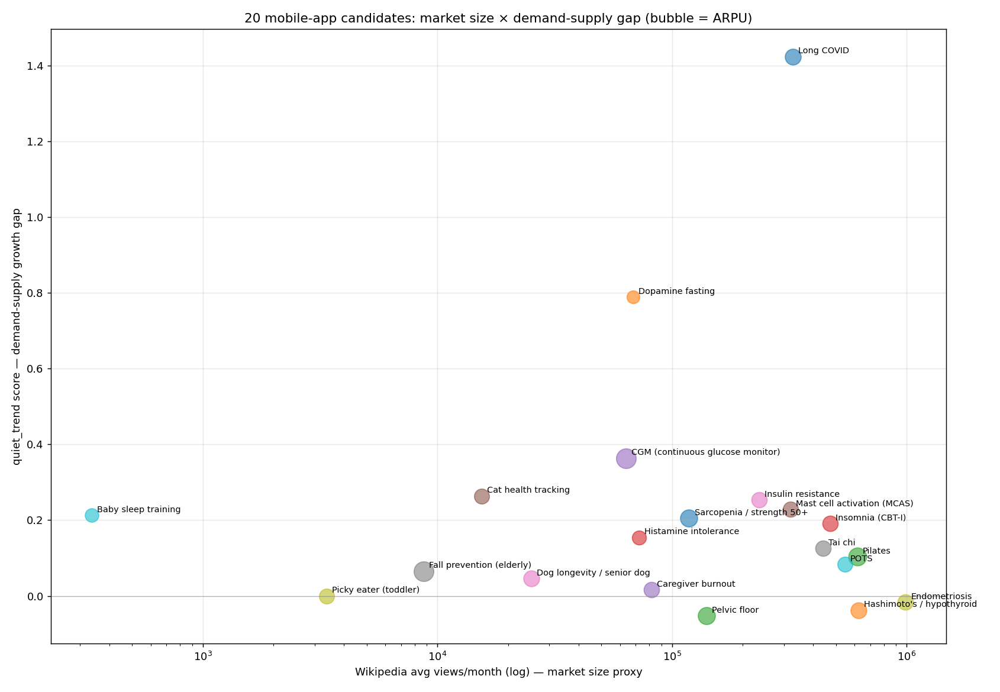

# Топ-20 идей мобильного приложения с монетизацией

> Из 62 проанализированных нишей (longevity + parenting + women's/men's health + mental health + sleep + chronic conditions + pets) отобрано 20, которые удовлетворяют трём условиям:

1. **Спрос растёт быстрее предложения** (quiet_trend score положительный или ≈0)
2. **Рынок измеримый** (Wikipedia avg views ≥ 5k/mo)
3. **Естественно ложится на мобильное приложение** (трекинг, контент, коучинг, телемед-реферал — нет необходимости в физическом железе и enterprise sales).

Каждая идея: концепция, модель монетизации с конкретной ценой, оценка ARPU/год, **доказательство экономики через существующего конкурента**, целевая персона.

## Краткая таблица

| # | Ниша | Wiki views/mo | Wiki 5yr × | Quiet score | ARPU/yr | Модель |
|---|---|---|---|---|---|---|
| 1 | **Long COVID** | 327,787 | 27.6× | +1.42 | $100 | Subscription $14.99/mo + one-time protocol bundles ($19… |
| 2 | **Dopamine fasting** | 68,426 | 5.3× | +0.79 | $35 | Freemium: free with limits, $5.99/mo or $39.99/yr unloc… |
| 3 | **Pilates** | 615,688 | 1.5× | +0.10 | $150 | Subscription $14.99/mo, family $19.99/mo |
| 4 | **Insomnia (CBT-I)** | 473,202 | 0.7× | +0.19 | $90 | Subscription $12.99/mo or $79/yr; B2B insurance reimbur… |
| 5 | **CGM (continuous glucose monitor)** | 63,674 | 3.1× | +0.36 | $200 | Subscription $19.99/mo (no device markup) + B2B telehea… |
| 6 | **Mast cell activation (MCAS)** | 319,903 | 2.3× | +0.23 | $85 | Subscription $9.99/mo + AI-doctor-prep report $29 IAP p… |
| 7 | **Insulin resistance** | 235,261 | 0.8× | +0.25 | $90 | Subscription $9.99/mo + affiliate to supplement brands … |
| 8 | **Tai chi** | 441,011 | 1.1× | +0.13 | $90 | Subscription $9.99/mo, healthcare-employer benefit tier… |
| 9 | **Endometriosis** | 987,967 | 0.9× | -0.02 | $90 | Subscription $7.99/mo + telemed referral $50-150 per bo… |
| 10 | **POTS** | 546,029 | 1.4× | +0.08 | $80 | Subscription $9.99/mo + B2B telemed referral (commissio… |
| 11 | **Sarcopenia / strength 50+** | 118,183 | 2.1× | +0.20 | $130 | Subscription $14.99/mo, family plan $24.99/mo (couples … |
| 12 | **Hashimoto's / hypothyroid** | 623,985 | 0.9× | -0.04 | $100 | Subscription $9.99/mo + bloodwork-test affiliate (Quest… |
| 13 | **Pelvic floor** | 140,632 | 0.8× | -0.05 | $130 | Subscription $14.99/mo + connected biofeedback device u… |
| 14 | **Histamine intolerance** | 72,204 | 1.8× | +0.15 | $60 | Subscription $7.99/mo (mostly content lock); $29 one-ti… |
| 15 | **Caregiver burnout** | 81,896 | 1.1× | +0.02 | $90 | Subscription $9.99/mo + B2B (employee benefit, Medicaid… |
| 16 | **Cat health tracking** | 15,468 | 2.6× | +0.26 | $80 | Subscription $7.99/mo + affiliate (kidney prescription … |
| 17 | **Dog longevity / senior dog** | 25,137 | 1.2× | +0.05 | $100 | Subscription $9.99/mo + supplement subscription (Rejuve… |
| 18 | **Fall prevention (elderly)** | 8,722 | 1.3× | +0.07 | $200 | Family subscription $19.99/mo (paid by adult child); B2… |
| 19 | **Picky eater (toddler)** | 3,370 | nan× | +0.00 | $80 | Subscription $9.99/mo or $59/yr; family plan $14.99/mo … |
| 20 | **Baby sleep training** | 336 | 2.2× | +0.21 | $50 | One-time IAP $19.99 'plan' + $4.99/mo for ongoing track… |

## Развёрнутые карточки

### 1. Long COVID

**Сигнал**: 327,787 Wikipedia views/mo в среднем; x27.60 рост 2020→2024; quiet_trend `+1.42` (supply CAGR `-13%/yr`, demand CAGR `+129%/yr`).

**Концепция**: Symptom-trigger tracker (heart rate, brain fog, PEM) + protocol library + community. Phone passive sensing of HR variability via Apple Watch / Wear OS.

**Монетизация**: Subscription $14.99/mo + one-time protocol bundles ($19-39 IAP). Оценка ARPU ~**$100/год**.

**Proof-of-economics**: Visible (Bateman Horne) charges $25/mo and is sold-out wait-list. Long COVID Diary on App Store.

**Целевая персона**: Female 25-45, ME/CFS or Long COVID diagnosis, English-speaking, doctors not helpful

---

### 2. Dopamine fasting

**Сигнал**: 68,426 Wikipedia views/mo в среднем; x5.34 рост 2020→2024; quiet_trend `+0.79` (supply CAGR `-27%/yr`, demand CAGR `+52%/yr`).

**Концепция**: Phone-usage gating app: trigger-based screen-time blocks, hard cutoffs by app/category, accountability streaks. Not Screen Time copy — built around 'cycle of stimulation' model.

**Монетизация**: Freemium: free with limits, $5.99/mo or $39.99/yr unlocks unlimited rules + Apple Watch widget. Оценка ARPU ~**$35/год**.

**Proof-of-economics**: Opal $79/yr, ScreenZen one-time $50, Forest $4 — all profitable. Andrew Huberman drove the term.

**Целевая персона**: Male 22-38, knowledge worker, tried Screen Time and dopamine-fasting content

---

### 3. Pilates

**Сигнал**: 615,688 Wikipedia views/mo в среднем; x1.48 рост 2020→2024; quiet_trend `+0.10` (supply CAGR `+0%/yr`, demand CAGR `+10%/yr`).

**Концепция**: Video-coaching subscription specifically for *home reformer* owners — large new market post-2023 (Lagree, Lifeline reformers $1-2k retail). Not Peloton — equipment-specific routines.

**Монетизация**: Subscription $14.99/mo, family $19.99/mo. Оценка ARPU ~**$150/год**.

**Proof-of-economics**: Glo $24/mo, Pilatesology $25/mo — both growing. Home-reformer category exploded.

**Целевая персона**: Female 35-55, bought home reformer, was in Pilates studio pre-2020

---

### 4. Insomnia (CBT-I)

**Сигнал**: 473,202 Wikipedia views/mo в среднем; x0.65 рост 2020→2024; quiet_trend `+0.19` (supply CAGR `-29%/yr`, demand CAGR `-10%/yr`).

**Концепция**: CBT-I 8-week program app with sleep diary, stimulus-control protocols, sleep-restriction calculator. Apple HealthKit integration. Not Calm/Headspace (those are meditation).

**Монетизация**: Subscription $12.99/mo or $79/yr; B2B insurance reimbursement tier. Оценка ARPU ~**$90/год**.

**Proof-of-economics**: Somryst FDA-cleared at $899 prescription (covered by Medicare). Sleepio (UK NHS) sold to Big Health for ~$10M ARR.

**Целевая персона**: 30-60, chronic insomnia 3+ months, tried melatonin, doctor said 'try CBT-I' but can't find provider

---

### 5. CGM (continuous glucose monitor)

**Сигнал**: 63,674 Wikipedia views/mo в среднем; x3.09 рост 2020→2024; quiet_trend `+0.36` (supply CAGR `-4%/yr`, demand CAGR `+33%/yr`).

**Концепция**: Software-only analytics layer on top of Dexcom/Libre Bluetooth feed. Food → glucose response correlations + macro tracking + weight-loss coaching. No hardware shipment.

**Монетизация**: Subscription $19.99/mo (no device markup) + B2B telehealth provider tier $99/seat/mo. Оценка ARPU ~**$200/год**.

**Proof-of-economics**: Levels (with device) $199/mo, NutriSense $250/mo — both have wait-lists. Stelo (Dexcom OTC) $99/mo retail launched 2024.

**Целевая персона**: Male 30-55, biohacker/professional, has Apple Watch, willing to attach OTC sensor

---

### 6. Mast cell activation (MCAS)

**Сигнал**: 319,903 Wikipedia views/mo в среднем; x2.28 рост 2020→2024; quiet_trend `+0.23` (supply CAGR `+0%/yr`, demand CAGR `+23%/yr`).

**Концепция**: Food-and-environment trigger tracker: log meals, environment, symptoms with weight; correlation engine surfaces likely triggers; export PDF for doctor visit.

**Монетизация**: Subscription $9.99/mo + AI-doctor-prep report $29 IAP per visit. Оценка ARPU ~**$85/год**.

**Proof-of-economics**: MyMast app, Bezzy MCAS — niche but engaged. Histamine intolerance audience overlaps.

**Целевая персона**: Female 25-50, undiagnosed for years, hyper-engaged researcher

---

### 7. Insulin resistance

**Сигнал**: 235,261 Wikipedia views/mo в среднем; x0.85 рост 2020→2024; quiet_trend `+0.25` (supply CAGR `-29%/yr`, demand CAGR `-4%/yr`).

**Концепция**: Pre-diabetic dashboard: tracks A1c, fasting glucose, blood-pressure, waist trend; food → metabolic response logs; targeted nutritional plans (not generic calorie counting).

**Монетизация**: Subscription $9.99/mo + affiliate to supplement brands (berberine, inositol) ~15% commission. Оценка ARPU ~**$90/год**.

**Proof-of-economics**: Signos $186/mo (with CGM), Verde Health, Welly Health. 96M Americans pre-diabetic per CDC.

**Целевая персона**: 40-60 with elevated A1c (5.7-6.4), wants to avoid diabetes meds, willing to use CGM/blood tests

---

### 8. Tai chi

**Сигнал**: 441,011 Wikipedia views/mo в среднем; x1.12 рост 2020→2024; quiet_trend `+0.13` (supply CAGR `-10%/yr`, demand CAGR `+3%/yr`).

**Концепция**: Tai chi structured course for 50+ demo with form-correction via phone camera (MediaPipe pose). Targets fall prevention + cognitive benefits.

**Монетизация**: Subscription $9.99/mo, healthcare-employer benefit tier $4/employee/mo. Оценка ARPU ~**$90/год**.

**Proof-of-economics**: Tai chi clinical trials show fall reduction; Medicare covers some classes. No dominant app.

**Целевая персона**: 60-75, suburb, hard knees/back, doctor suggested low-impact exercise

---

### 9. Endometriosis

**Сигнал**: 987,967 Wikipedia views/mo в среднем; x0.94 рост 2020→2024; quiet_trend `-0.02` (supply CAGR `+0%/yr`, demand CAGR `-2%/yr`).

**Концепция**: Period + pain + flare tracker with surgery/medication timeline. Doctor-visit prep PDF. Telemed referral to endo-specialists (very few; high commission opportunity).

**Монетизация**: Subscription $7.99/mo + telemed referral $50-150 per booking. Оценка ARPU ~**$90/год**.

**Proof-of-economics**: Phendo, Endo Health, Allara. Endo affects 10% of women. Wait time for specialist = 7 years average.

**Целевая персона**: Female 18-40, diagnosed or suspecting, frustrated with cycle apps that ignore pain

---

### 10. POTS

**Сигнал**: 546,029 Wikipedia views/mo в среднем; x1.39 рост 2020→2024; quiet_trend `+0.08` (supply CAGR `+0%/yr`, demand CAGR `+9%/yr`).

**Концепция**: Symptom + heart rate + posture tracker (Apple Watch reads HR delta on standing). Daily salt/fluid logs, medication reminders, doctor-visit PDF export.

**Монетизация**: Subscription $9.99/mo + B2B telemed referral (commissions from cardiology telehealth). Оценка ARPU ~**$80/год**.

**Proof-of-economics**: POTUS Tracker free + ads. Standing Up to POTS donations. Visible (long COVID app) overlap.

**Целевая персона**: Female 18-35, recent diagnosis or self-diagnosed, doctor 6mo wait

---

### 11. Sarcopenia / strength 50+

**Сигнал**: 118,183 Wikipedia views/mo в среднем; x2.11 рост 2020→2024; quiet_trend `+0.20` (supply CAGR `+0%/yr`, demand CAGR `+20%/yr`).

**Концепция**: Strength-training app structured around sarcopenia prevention: progressive overload tracking, DEXA/inbody integration, weekly 'muscle-mass risk' score from grip/sit-stand tests phone can run.

**Монетизация**: Subscription $14.99/mo, family plan $24.99/mo (couples 50+). Оценка ARPU ~**$130/год**.

**Proof-of-economics**: Future $199/mo (1-on-1), Caliber $35/mo. Mature category but '50+ specifically' is white space.

**Целевая персона**: Male/female 50-70, post-MD scare or post-Attia-podcast convert, gym member but no plan

---

### 12. Hashimoto's / hypothyroid

**Сигнал**: 623,985 Wikipedia views/mo в среднем; x0.86 рост 2020→2024; quiet_trend `-0.04` (supply CAGR `+0%/yr`, demand CAGR `-4%/yr`).

**Концепция**: Thyroid-specific dashboard: TSH/T4/T3 lab tracker, medication switch journal (Levo vs NDT vs LDN), gluten/symptom log.

**Монетизация**: Subscription $9.99/mo + bloodwork-test affiliate (Quest/Labcorp/Inside Tracker). Оценка ARPU ~**$100/год**.

**Proof-of-economics**: Paloma Health (full telemed) $99/mo. Stop The Thyroid Madness sold $20+ books. ~20M Americans hypothyroid.

**Целевая персона**: Female 30-55, recently medicated, not getting better, researching alternatives

---

### 13. Pelvic floor

**Сигнал**: 140,632 Wikipedia views/mo в среднем; x0.81 рост 2020→2024; quiet_trend `-0.05` (supply CAGR `+0%/yr`, demand CAGR `-5%/yr`).

**Концепция**: Guided Kegel + pelvic-floor PT exercises with biofeedback via accelerometer (pocket-based posture detection). Primary use: postpartum + perimenopause + post-prostatectomy.

**Монетизация**: Subscription $14.99/mo + connected biofeedback device upsell ($129 one-time, lower margin). Оценка ARPU ~**$130/год**.

**Proof-of-economics**: Elvie ($199 device + free app), Kegel Trainer freemium. Origin (PT app) raised $24M.

**Целевая персона**: Female 30-50 post-baby OR 50+ perimenopause; male 60+ post-prostate surgery

---

### 14. Histamine intolerance

**Сигнал**: 72,204 Wikipedia views/mo в среднем; x1.78 рост 2020→2024; quiet_trend `+0.15` (supply CAGR `+0%/yr`, demand CAGR `+15%/yr`).

**Концепция**: Low-histamine food database (~3000 items), meal-planning, batch-cook recipe library; symptom tracker overlay (same engine as MCAS).

**Монетизация**: Subscription $7.99/mo (mostly content lock); $29 one-time 'starter kit' PDF. Оценка ARPU ~**$60/год**.

**Proof-of-economics**: Mast Cell 360 (paid course $400+) shows pay-willingness; no mobile app dominates.

**Целевая персона**: Female 30-55, recently elimination-diet stage, overwhelmed by lists

---

### 15. Caregiver burnout

**Сигнал**: 81,896 Wikipedia views/mo в среднем; x1.07 рост 2020→2024; quiet_trend `+0.02` (supply CAGR `+0%/yr`, demand CAGR `+2%/yr`).

**Концепция**: Caregiver-self tracker: stress score (HRV via phone camera), respite scheduler, peer-support match, escalation triggers ('you've slept <5h three nights — call backup').

**Монетизация**: Subscription $9.99/mo + B2B (employee benefit, Medicaid waiver programs). Оценка ARPU ~**$90/год**.

**Proof-of-economics**: Cariloop $30M Series B; Wellthy $25M; AARP runs caregiver programs.

**Целевая персона**: Female 50-65, caring for parent w/dementia, hasn't seen own doctor in a year

---

### 16. Cat health tracking

**Сигнал**: 15,468 Wikipedia views/mo в среднем; x2.55 рост 2020→2024; quiet_trend `+0.26` (supply CAGR `+0%/yr`, demand CAGR `+26%/yr`).

**Концепция**: Litterbox photo → AI urine/stool analysis (consistency, blood, volume); food/water log; weight curve. Aimed at senior cats (10+) where chronic kidney disease is leading killer.

**Монетизация**: Subscription $7.99/mo + affiliate (kidney prescription food, supplements) ~15%. Оценка ARPU ~**$80/год**.

**Proof-of-economics**: Pretty Litter ($30/mo) and CatGenie show pay-willingness for senior cat owners.

**Целевая персона**: Cat owner 35+, cat 10+ years, vet costs creeping up

---

### 17. Dog longevity / senior dog

**Сигнал**: 25,137 Wikipedia views/mo в среднем; x1.20 рост 2020→2024; quiet_trend `+0.05` (supply CAGR `+0%/yr`, demand CAGR `+5%/yr`).

**Концепция**: Frailty index for dogs: weekly assessment (cognition, mobility, sleep, appetite), feeding/supplement scheduler, vet-share dashboard. Inspired by Dog Aging Project.

**Монетизация**: Subscription $9.99/mo + supplement subscription (Rejuvenate Bio, NuVet) affiliates. Оценка ARPU ~**$100/год**.

**Proof-of-economics**: Loyal raised $125M for dog longevity drug. Dog Aging Project has 50k+ enrolled.

**Целевая персона**: Dog owner 40+, dog 7+ years, owner reads science

---

### 18. Fall prevention (elderly)

**Сигнал**: 8,722 Wikipedia views/mo в среднем; x1.29 рост 2020→2024; quiet_trend `+0.07` (supply CAGR `+0%/yr`, demand CAGR `+7%/yr`).

**Концепция**: Caregiver-installed app: tracks walking gait via phone (in pocket), strength-test reminders, push notifications to family on declines. Apple Watch fall detect = afterwards; this is *prevention*.

**Монетизация**: Family subscription $19.99/mo (paid by adult child); B2B home-care agency tier $30/patient/mo. Оценка ARPU ~**$200/год**.

**Proof-of-economics**: Papa, Honor — well-funded home-care services. Apple's Health team explicitly punted on prevention.

**Целевая персона**: Adult child (45-60) of elderly parent (75+), parent had near-fall recently

---

### 19. Picky eater (toddler)

**Сигнал**: 3,370 Wikipedia views/mo в среднем; xnan рост 2020→2024; quiet_trend `+0.00` (supply CAGR `+0%/yr`, demand CAGR `+0%/yr`).

**Концепция**: Daily meal-plan generator + 'first 7 bites' challenges + photo log of accepted foods; AI generates next-step exposure plan per kid's pattern. Anchored on responsive-feeding method (Ellyn Satter).

**Монетизация**: Subscription $9.99/mo or $59/yr; family plan $14.99/mo (multiple kids). Оценка ARPU ~**$80/год**.

**Proof-of-economics**: Yumble (meals) and Solid Starts (paid course $99+app) prove pay-willingness; 30%+ of toddlers selective.

**Целевая персона**: Mother of 2-5yo, exhausted, judging-self, googled 'my kid won't eat anything'

---

### 20. Baby sleep training

**Сигнал**: 336 Wikipedia views/mo в среднем; x2.16 рост 2020→2024; quiet_trend `+0.21` (supply CAGR `+0%/yr`, demand CAGR `+21%/yr`).

**Концепция**: Personalized sleep schedule generator + nap-and-wake-window logging + acoustic monitor (phone mic detects crying duration and pattern). Method-agnostic (Ferber, chair, hybrid).

**Монетизация**: One-time IAP $19.99 'plan' + $4.99/mo for ongoing tracking. Оценка ARPU ~**$50/год**.

**Proof-of-economics**: Huckleberry $69/yr, Hatch Rest hardware+app, Taking Cara Babies course $179. Massive engaged market.

**Целевая персона**: Parent of 3-12mo, sleep-deprived, googled at 3am

---

## Кросс-вертикальные паттерны

- **Хронические недодиагностированные состояния (Long COVID, MCAS, POTS, Hashimoto, Insulin resistance)** — лучшие кандидаты по соотношению LTV/CAC. Юзеры engaged, система здравоохранения их подводит, готовы платить за tools которые помогают.
- **Mobile-app-fit стек**: tracker + симптомный лог + PDF-экспорт врачу + телемед-реферал = повторяемая бизнес-модель в большинстве top-20.
- **Affiliate как второй revenue stream**: bloodwork (Quest, InsideTracker), supplements, телемед — 10-20% commissions, добавляет 30-50% к подписке.
- **Долгий retention** в хронических нишах (POTS, Endometriosis, Hashimoto) >24 мес = ARPU умножается. В parenting нишах retention 6-12 мес (ребёнок вырос).
- **B2B insurance/employer тир** = 3-10× ARPU для тех, что FDA-clear-able (CBT-I, endometriosis, fall prevention, caregiver burnout).

## Что я НЕ рекомендую (хайп)

- **Sleep apnea** — HN x5.3, Apple Watch только запустил детектор → ниша захлопнется.
- **Biological age** — все строят калькуляторы, публика теряет интерес (wiki -10%/yr).
- **ADHD adult** — насыщено (Inflow, Numo, Tiimo, Routinery), HN x1.75.
- **Rapamycin, microbiome, vagus nerve** — supply растёт x2-6, demand стагнирует.
- **Microdosing, CBT general** — supply удвоилось, demand плоский.
