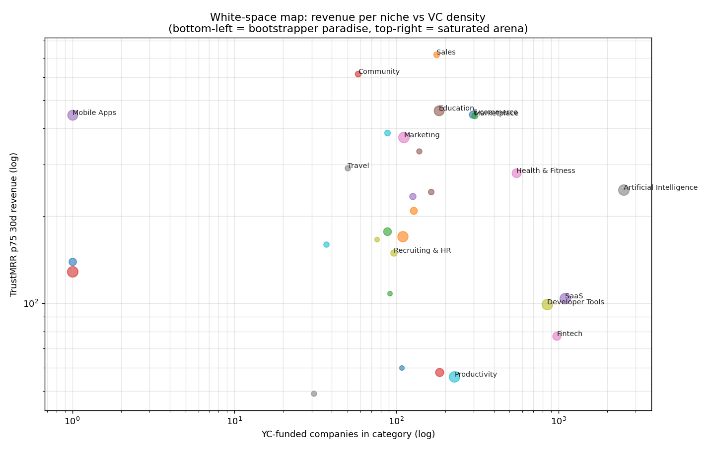
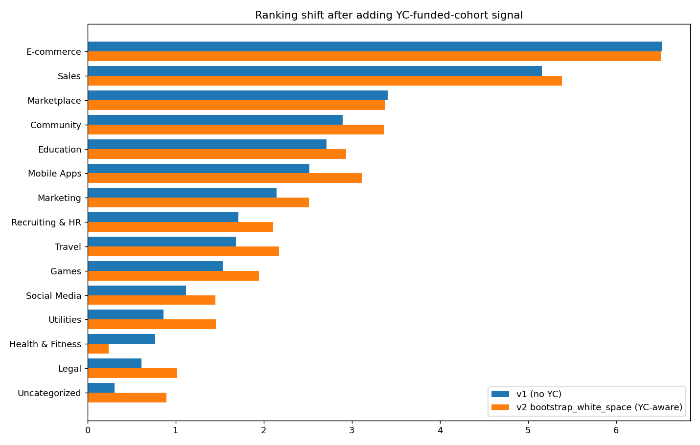

# Micro-SaaS Niche Research — v2 (YC funded cohort added)

> v1 used TrustMRR (revenue) + Habr/Reddit (demand) + Product Hunt (saturation) + awesome-oss-* (OSS competition). v2 adds **YC Company Directory** (5,925 funded companies, 332 tags) as a 6th orthogonal signal.

**Why this matters**: YC density is a proxy for **VC attention**. Niches with high TrustMRR signal *and low YC density* are textbook "bootstrapper paradise" — real money is being made there but smart institutional money is elsewhere. Niches with **high YC density and recent-batch share** (especially AI at 37% from 2024+) are arenas: lots of well-funded competitors, not the place for $20/mo SaaS.

## YC global view

- Loaded **5925 YC companies** across 332 unique tags. Top 10 tags by count: B2B (1,101), SaaS (1,099), AI (932), Fintech (699), Developer Tools (540), Marketplace (304), Generative AI (259), Consumer (241), Machine Learning (228), Healthcare (203).
- AI tag's 2024+ batch share: **42%** — every other YC batch is AI.
- Marketplace 2024+ share: **5%** — YC has visibly pulled back from marketplaces.

## Two scores side by side

| Category | v1 score | v2 bootstrap (YC-aware) | YC funded | YC 2024+ share |
|---|---|---|---|---|
| **E-commerce** | +6.52 | +6.51 | 296 | 7% |
| **Sales** | +5.16 | +5.39 | 177 | 27% |
| **Marketplace** | +3.41 | +3.38 | 304 | 5% |
| **Community** | +2.89 | +3.37 | 58 | 2% |
| **Mobile Apps** | +2.52 | +3.11 | 0 | 0% |
| **Education** | +2.71 | +2.93 | 183 | 11% |
| **Marketing** | +2.15 | +2.51 | 111 | 23% |
| **Travel** | +1.68 | +2.17 | 50 | 18% |
| **Recruiting & HR** | +1.71 | +2.10 | 96 | 16% |
| **Games** | +1.53 | +1.95 | 88 | 9% |
| **Utilities** | +0.86 | +1.46 | 0 | 0% |
| **Social Media** | +1.12 | +1.45 | 128 | 16% |
| **Legal** | +0.61 | +1.02 | 91 | 36% |
| **Uncategorized** | +0.31 | +0.90 | 0 | 0% |
| **Entertainment** | +0.13 | +0.46 | 126 | 23% |

## Top 5 bootstrapper niches (high TrustMRR signal, low YC saturation)

### E-commerce — `+6.51`

- **TrustMRR**: 136 startups, p75 30d rev **$447**, top earner **$7.1M**, **21%** profitable
- **YC funded**: 296 companies; 7% from 2024+ batches; alive_rate 57%
- **Matched YC tags**: E-Commerce|E-commerce|Retail|Retail Tech
- **PH 12mo launches**: 2616; **OSS alternatives**: 11
- **Top 3 incumbents (last 30d revenue)**:
  - **Gumroad** — $7.1M (US)
  - **easytools** — $2.7M (PL)
  - **Brand On Demand, Inc.** — $1.1M (US)

### Sales — `+5.39`

- **TrustMRR**: 66 startups, p75 30d rev **$719**, top earner **$78.6k**, **21%** profitable
- **YC funded**: 177 companies; 27% from 2024+ batches; alive_rate 75%
- **Matched YC tags**: CRM|Sales|Sales Enablement
- **PH 12mo launches**: 1842; **OSS alternatives**: 2
- **Top 3 incumbents (last 30d revenue)**:
  - **Salesrobot, INC** — $78.6k (US)
  - **Lancer.app** — $16.3k (EE)
  - **Bookedin** — $11.0k (US)

### Marketplace — `+3.38`

- **TrustMRR**: 85 startups, p75 30d rev **$443**, top earner **$189.3k**, **24%** profitable
- **YC funded**: 304 companies; 5% from 2024+ batches; alive_rate 63%
- **Matched YC tags**: Marketplace
- **PH 12mo launches**: 2616; **OSS alternatives**: 0
- **Top 3 incumbents (last 30d revenue)**:
  - **PressWhizz** — $189.3k (US)
  - **MaidsnBlack** — $128.3k (US)
  - **Anonymous startup** — $122.9k (nan)

### Community — `+3.37`

- **TrustMRR**: 68 startups, p75 30d rev **$617**, top earner **$29.4k**, **19%** profitable
- **YC funded**: 58 companies; 2% from 2024+ batches; alive_rate 45%
- **Matched YC tags**: Community
- **PH 12mo launches**: 4204; **OSS alternatives**: 4
- **Top 3 incumbents (last 30d revenue)**:
  - **Athletiks** — $29.4k (ES)
  - **Advise.so** — $20.1k (CA)
  - **Fundlyhub** — $19.8k (US)

### Mobile Apps — `+3.11`

- **TrustMRR**: 318 startups, p75 30d rev **$446**, top earner **$98.5k**, **17%** profitable
- **YC funded**: 0 companies; 0% from 2024+ batches; alive_rate 0%
- **PH 12mo launches**: —; **OSS alternatives**: 0
- **Top 3 incumbents (last 30d revenue)**:
  - **PropGPT: AI Props Analysis** — $98.5k (US)
  - **Anonymous startup** — $36.6k (CA)
  - **Anonymous startup** — $28.5k (FR)

## VC-saturated arenas to AVOID (bootstrap_white_space < -2)

| Category | YC funded | YC 2024+ share | p75 rev | bootstrap_score |
|---|---|---|---|---|
| **Productivity** | 228 | 19% | $56 | -8.22 |
| **Developer Tools** | 852 | 28% | $99 | -7.50 |
| **Artificial Intelligence** | 2528 | 37% | $246 | -5.77 |
| **Fintech** | 976 | 10% | $77 | -4.08 |
| **Security** | 138 | 21% | $334 | -2.78 |
| **SaaS** | 1099 | 14% | $104 | -2.75 |
| **Analytics** | 184 | 16% | $58 | -2.58 |
| **Design Tools** | 88 | 28% | $177 | -1.70 |

**AI** stands out: 2,528 YC-funded companies including 932 in 2024+ batches. Every $20/mo AI wrapper is competing with someone who just raised $5M seed.

## Charts

## What changed from v1 to v2

- **Community** stays in top-5 and gains: only 58 YC-funded companies, 2% recent share. Bootstrap-friendly.
- **AI** drops out of the global top entirely — was already negative score, now more so.
- **Health & Fitness** drops: 551 YC-funded with steady recent activity = VCs love it; p75 rev30 only $280 = bootstrappers struggle. Mismatch.
- **Marketing** falls from #5 to #7 — 111 YC + 23% recent = increasingly competitive.
- **Mobile Apps** moves up because YC has zero mobile-tagged plays (YC tags are infra-leaning) and p75 $446 + 17% profit rate is real.

## Sources & caveats

- YC API: `api.ycombinator.com/v0.1/companies` (public). 5,925 companies × 332 tags. Tags are self-reported by founders.
- YC ≠ market — it's a sample of *funded* startups, biased toward US/SV and B2B/AI.
- Mapping YC tags → TrustMRR categories is regex-based (`src/synthesize_v2.py`). Some overlap (e.g. "AI" matches both "Artificial Intelligence" and "AI Assistant").
